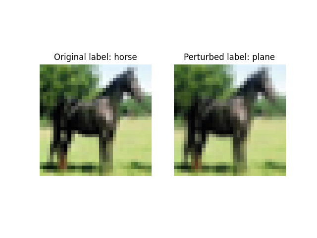
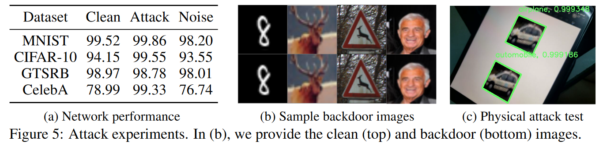
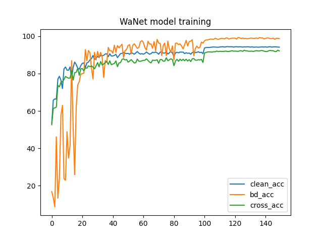
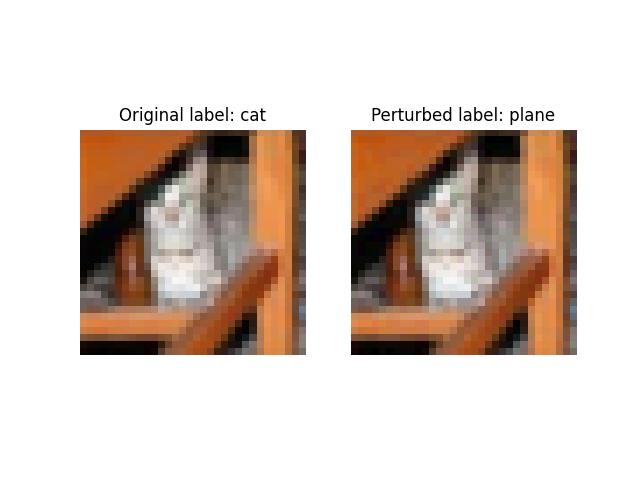
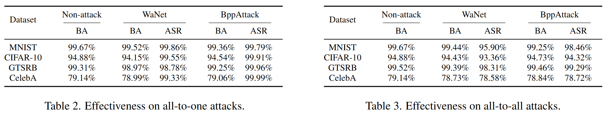
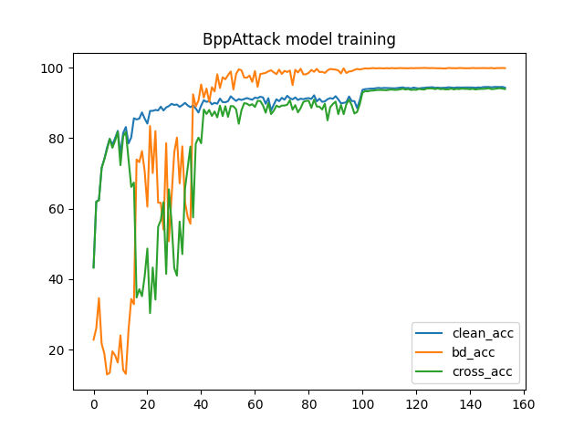

# 代码复现报告

> 2022302181276 潘鸿远 信息安全 
>
> github: <https://github.com/Siestazzz/AiSec_Replication_Report>


## DeepFool

**注：由于作者源代码使用的是ImageNet训练集（pytorch预训练的ResNet18），而要求用的是cifar10，所以这里使用了<https://github.com/ZOMIN28/ResNet18_Cifar10_95.46>的预训练模型**


### 攻击思路

大致思路为将超平面泰勒一阶展开，求出其法向量，然后朝着法向量的方向前进一定步长，重复该步骤直至越过超平面，则改变了其分类，实现攻击。

### 代码解析

#### 项目结构

```
DeepFool-master/
│
├── MATLAB
│
└── Python/
    ├── pic.jpg				--cifar10的原始图片
	├──	pic_perturbed.jpg	--对抗样本
    ├── test_deepfool.py	--主程序
	└── deepfool.py			--deepfool主要逻辑
```

#### test_deepfool.py

更改了加载的模型，因此图像预处理也进行了更改

```python
# set device
device = 'cuda' if torch.cuda.is_available() else 'cpu'
n_class = 10
batch_size = 100
model = ResNet18() # 得到预训练模型
model.conv1 = nn.Conv2d(in_channels=3, out_channels=64, kernel_size=3, stride=1, padding=1, bias=False)
model.fc = torch.nn.Linear(512, n_class) # 将最后的全连接层修改
# 载入权重
model.load_state_dict(torch.load('checkpoint/resnet18_cifar10.pt'))
model = model.to(device)
model.eval()

im_orig = Image.open('pic.jpg')

# Remove the mean
im = transforms.Compose([
        transforms.ToTensor(),
        transforms.Normalize(mean=[0.485, 0.456, 0.406],std=[0.229, 0.224, 0.225]),
    ])(im_orig)

r, loop_i, label_orig, label_pert, pert_image = deepfool(im, model)
```

#### deepfool.py

参数部分，image为干净图像，net为预训练ResNet18，num_class为分类结果的种类数，overshoot为使结果越过决策边界的微小值，max_iter为最大迭代次数（deepfool需要多次迭代）

```python
def deepfool(image, net, num_classes=10, overshoot=0.02, max_iter=50):
```

先获取模型对原始图片分类的标签$label$

```python
f_image = net.forward(Variable(image[None, :, :, :], requires_grad=True)).data.cpu().numpy().flatten()
I = (np.array(f_image)).flatten().argsort()[::-1]
print(I)
I = I[0:num_classes]
label = I[0]

input_shape = image.cpu().numpy().shape
pert_image = copy.deepcopy(image)
w = np.zeros(input_shape)
r_tot = np.zeros(input_shape)

loop_i = 0

x = Variable(pert_image[None, :], requires_grad=True)
fs = net.forward(x)
fs_list = [fs[0,I[k]] for k in range(num_classes)]
k_i = label
```

两层循环，第一层每次增加一部分扰动，第二层在所有改变决策分类的方向中选出一个距离最短的方向。

论文中生成扰动的公式为：

$${\bf{r}}_*({\bf{x}_0})=\frac{\left\vert f_{\widehat{l}({\bf{x}}_0)}({\bf{x}}_0)-f_{\widehat{k}({\bf{x}}_0)}({\bf{x}}_0)\right\vert}{\|{\bf{w}}_{\widehat{l}({\bf{x}}_0)}-{\bf{w}}_{\widehat{k}({\bf{x}}_0)}\|_2^2}({\bf{w}}_{\widehat{l}({\bf{x}}_0)}-{\bf{w}}_{\widehat{k}({\bf{x}}_0)})$$

其中${\widehat{k}({\bf{x}}_0)}$对应label，${\widehat{l}({\bf{x}}_0)}$对应第二层循环中使扰动最小的k，$f(x_0)$对应fs。


内层循环，计算往分类k方向生成的扰动大小，并选出最小的一个存入pert中。

```python
for k in range(1, num_classes):
    zero_gradients(x)

    fs[0, I[k]].backward(retain_graph=True)
    cur_grad = x.grad.data.cpu().numpy().copy()

    # set new w_k and new f_k
    w_k = cur_grad - grad_orig
    f_k = (fs[0, I[k]] - fs[0, I[0]]).data.cpu().numpy()

    pert_k = abs(f_k)/np.linalg.norm(w_k.flatten())

    # determine which w_k to use
    if pert_k < pert:
        pert = pert_k
        w = w_k
```

计算扰动并累加，直至越过决策边界或超过迭代次数

```python
while k_i == label and loop_i < max_iter:

    pert = np.inf
    fs[0, I[0]].backward(retain_graph=True)
    grad_orig = x.grad.data.cpu().numpy().copy()

    for k in range(1, num_classes):
        #calculate pert（省略）

    # compute r_i and r_tot
    # Added 1e-4 for numerical stability
    r_i =  (pert+1e-4) * w / np.linalg.norm(w)
    r_tot = np.float32(r_tot + r_i)

    if is_cuda:
        pert_image = image + (1+overshoot)*torch.from_numpy(r_tot).cuda()
    else:
        pert_image = image + (1+overshoot)*torch.from_numpy(r_tot)

    x = Variable(pert_image, requires_grad=True)
    fs = net.forward(x)
    k_i = np.argmax(fs.data.cpu().numpy().flatten())

    loop_i += 1
```

### 运行结果

```shell
python test_deepfool.py
```

将deepfool攻击过后的图片识别为了ship。


### 复现难点

这篇论文的代码其实思路挺简单的，核心代码也就deepfool.py一个文件，结合论文公式很快就能理解了，唯一的难点是一开始没留意pytorch的ResNet预训练模型是用的ImageNet训练的，加上对pytorch的api不是很熟导致折腾了一段时间，还好别人的github仓库给了预训练模型不用自己训练（。


## WaNet

### 攻击思路

通过对输入图像进行不可察觉的扭曲， 同时引入噪声训练，使得模型在特定输入下输出特定结果，实现后门攻击。

### 代码解析

#### 项目结构

```
Warping-based_Backdoor_Attack-release-main/
│
├── checkpoints/				--保存的模型和训练数据
|
├──	WaNet_origin_image.jpg		--干净输入
|	
├── WaNet_perturbed_image.jpg	--后门图片
|
├──	train.py					--后门模型训练
|
└── eval.py						--评估模块
```

#### train.py

##### main()

论文生成扭曲场的公式为

$$P=\psi(rand_{[-1,1]}(k,k,2))\times s为$$

其中$rand_{[-1,1]}(k,k,2)$对应ins，但是将扰动扩展到整个图像，因此需要对扰动做一次上采样得到扰动noise_grid

``` python
else:
    print("Train from scratch!!!")
    best_clean_acc = 0.0
    best_bd_acc = 0.0
    best_cross_acc = 0.0
    epoch_current = 0

    # Prepare grid
    ins = torch.rand(1, 2, opt.k, opt.k) * 2 - 1
    ins = ins / torch.mean(torch.abs(ins))
    noise_grid = (
        F.upsample(ins, size=opt.input_height, mode="bicubic", align_corners=True)
        .permute(0, 2, 3, 1)
        .to(opt.device)
    )
```

还需要一个初始的控制网格，通过torch.linspace(-1, 1, steps=opt.input_height)生成均匀分布的初始控制网格identity_grid

```python
    array1d = torch.linspace(-1, 1, steps=opt.input_height)
    x, y = torch.meshgrid(array1d, array1d)
    identity_grid = torch.stack((y, x), 2)[None, ...].to(opt.device)
```

##### train()

netC为分类模型，noise_grid为噪声网格，identity_grid为初始网格，opt为配置数据

```python
def train(netC, optimizerC, schedulerC, train_dl, noise_grid, identity_grid, tf_writer, epoch, opt):
```

opt.s即公式里的$s$，即扰动强度，identity_grid加上扰动经过调整则得到我们需要的扭曲场grid_temps

```python
num_bd = int(bs * rate_bd)
num_cross = int(num_bd * opt.cross_ratio)
grid_temps = (identity_grid + opt.s * noise_grid / opt.input_height) * opt.grid_rescale
grid_temps = torch.clamp(grid_temps, -1, 1)
```

这里随机生成了一些扭曲场grid_temps2，作为噪声训练的交叉样本以增强模型的鲁棒性

```python
ins = torch.rand(num_cross, opt.input_height, opt.input_height, 2).to(opt.device) * 2 - 1
grid_temps2 = grid_temps.repeat(num_cross, 1, 1, 1) + ins / opt.input_height
grid_temps2 = torch.clamp(grid_temps2, -1, 1)
```

对输入inputs采样得到inputs_bd后门样本和inputs_cross交叉样本

```python
inputs_bd = F.grid_sample(inputs[:num_bd], grid_temps.repeat(num_bd, 1, 1, 1), align_corners=True)
if opt.attack_mode == "all2one":
    targets_bd = torch.ones_like(targets[:num_bd]) * opt.target_label
if opt.attack_mode == "all2all":
    targets_bd = torch.remainder(targets[:num_bd] + 1, opt.num_classes)
inputs_cross = F.grid_sample(inputs[num_bd : (num_bd + num_cross)], grid_temps2, align_corners=True)
```

将输入样本整合训练模型

```python
total_inputs = torch.cat([inputs_bd, inputs_cross, inputs[(num_bd + num_cross) :]], dim=0)
total_inputs = transforms(total_inputs)
total_targets = torch.cat([targets_bd, targets[num_bd:]], dim=0)
start = time()
total_preds = netC(total_inputs)
total_time += time() - start

loss_ce = criterion_CE(total_preds, total_targets)

loss = loss_ce
loss.backward()
```

### 运行结果

```shell
python eval.py
```

攻击方式为all2one，训练结果为留有后门的输入样本均是别为plane，准确率为Clean Acc: 94.3100 | Bd Acc: 98.9200 | Cross: 92.1600



论文数据如下，总体结果与论文相差不大。



模型训练曲线如下（150epochs，数据可见./checkpoints/cifar10/eval_result.pkl），可以看到交叉样本的识别率比干净样本要略低一些，但准确率仍有92.1600，攻击成功率达到98.9200，说明模型学习到了图片的扭曲模式，且具有较强的鲁棒性。



### 复现难点

这篇好像还真没什么难点，作者写的代码很漂亮，可以自主选择多种模式，模块化做的也很好，稍作改动可以拿来作为自己研究的框架。（后面的BppAttack就直接用了这篇的代码）


## BppAttack

### 攻击思路

通过图像量化压缩图片颜色深度，然后通过图像抖动消除不自然区域，训练模型使其学习到压缩后的攻击样本。

### 代码解析

#### 项目结构

```
Warping-based_Backdoor_Attack-release-main/
│
├── checkpoints/				--保存的模型和训练数据
|
├──	BppAttack_origin_image.jpg		--干净输入
|	
├── BppAttack_perturbed_image.jpg	--后门图片
|
├──	train.py					--后门模型训练
```

#### bppattack.py

##### main()

生成对抗训练的负样本，如果要添加图像抖动的话则在量化之后进行Floyd-Steinberg 扩散抖动，否则直接进行量化$$T({\bf{x}}) = \frac{round\left(\frac{\bf{x}}{2^{m}-1} * \left(2^{d}-1\right)\right)}{2^{d}-1}*\left(2^{m}-1\right)$$，其中opt.squeeze_num即$2^{d}-1$ ，255即$2^{m}-1$。

```python
for j in range(n):
    for batch_idx, (inputs, targets) in enumerate(train_dl):
        temp_negetive = back_to_np_4d(inputs,opt)

        temp_negetive_modified = back_to_np_4d(inputs,opt)
        if opt.dithering:
            for i in range(temp_negetive_modified.shape[0]):
                temp_negetive_modified[i,:,:,:] = torch.round(torch.from_numpy(floydDitherspeed(temp_negetive_modified[i].detach().cpu().numpy(),float(opt.squeeze_num))))
        else:
            temp_negetive_modified = torch.round(temp_negetive_modified/255.0*(opt.squeeze_num-1))/(opt.squeeze_num-1)*255

        residual = temp_negetive_modified - temp_negetive
        for i in range(residual.shape[0]):
            residual_list_train.append(residual[i].unsqueeze(0).cuda())
            count = count + 1
```

##### train()

residual_list_train用来生成负样本

```python
def train(train_transform, model, optimizer, scheduler, train_dl, tf_writer, epoch, opt, residual_list_train)
```

以同样的方法生成后门样本，然后对residual_list_train随机采样作为负样本（其实挺奇怪的可以直接用residual_list_train作为后门样本的），最后将所有样本合并。

```python
if num_bd!=0 and num_neg!=0:
    inputs_bd = back_to_np_4d(inputs[:num_bd],opt)
    if opt.dithering:
        for i in range(inputs_bd.shape[0]):
            inputs_bd[i,:,:,:] = torch.round(torch.from_numpy(floydDitherspeed(inputs_bd[i].detach().cpu().numpy(),float(opt.squeeze_num))).cuda())
    else:
    	inputs_bd = torch.round(inputs_bd/255.0*(squeeze_num-1))/(squeeze_num-1)*255

        inputs_bd = np_4d_to_tensor(inputs_bd,opt)

        if opt.attack_mode == "all2one":
            targets_bd = torch.ones_like(targets[:num_bd]) * opt.target_label
        if opt.attack_mode == "all2all":
            targets_bd = torch.remainder(targets[:num_bd] + 1, opt.num_classes)

        inputs_negative = back_to_np_4d(inputs[num_bd : (num_bd + num_neg)],opt) + torch.cat(random.sample(residual_list_train,num_neg),dim=0)
        inputs_negative=torch.clamp(inputs_negative,0,255)
        inputs_negative = np_4d_to_tensor(inputs_negative,opt)

        total_inputs = torch.cat([inputs_bd, inputs_negative, inputs[(num_bd + num_neg) :]], dim=0)
        total_targets = torch.cat([targets_bd, targets[num_bd:]], dim=0)
```


### 运行结果

攻击方式为all2one，训练结果为对所有后门图像识别为plane，成功率为Clean Acc: 94.5 | Bd Acc: 99.9400 | Cross: 94.0300，攻击成功率几乎达100%。



论文的数据如下，all2one的情况下基本与论文数据一致。



模型训练图如下（150epochs，数据可见./checkpoints/cifar10/eval_result.pkl）



### 复现难点

作者代码从WaNet改的，因此看完WaNet也没啥难点了，对应的一些修改也可以直接套用WaNet的代码，唯一的难点应该是每次重新跑都要对所有输入样本进行量化和抖动，等的有点久，还有就是作者代码有点小问题，以及疏忽了floydDitherspeed函数里进行了图像量化的处理。


